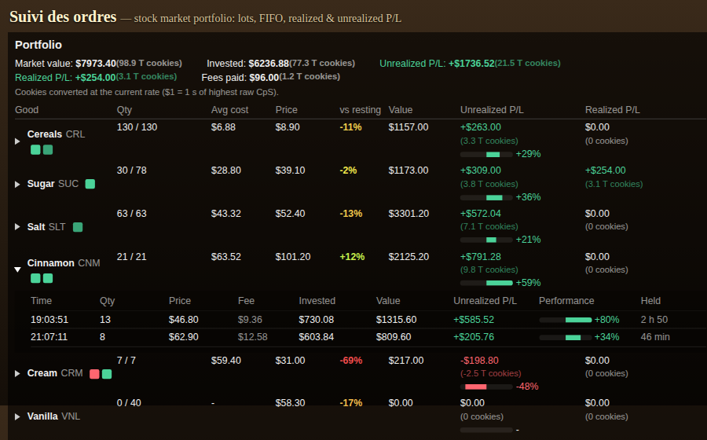

# Suivi des ordres — Cookie Clicker

Mod for Cookie Clicker (Steam) that adds a **Portfolio** button (**Portefeuille** in French) to the Bank row. It keeps a lot-based ledger of your stock-market orders, in the spirit of [Suivi des ordres](https://github.com/Akmot9/actions_true_perf):

- one lot per purchase (time, quantity, price, fee);
- sales are matched FIFO, so cost basis and realized P/L are rebuilt lot by lot;
- fees follow the sold quantities pro rata;
- realized P/L, unrealized P/L and fees are shown separately, in $ and in cookies;
- stock that was bought before the mod was running is shown as *without history* and never valued in the P/L;
- the distance to each good's resting value is signed and coloured from red (far below) to green (above).



The panel follows the game's language: French when the game is in French, English otherwise.

The ledger is stored in the game save. The mod only observes: it never buys or sells for you and does not block Steam achievements.

## Install (Steam, Linux)
```bash
git clone https://github.com/Akmot9/cookie-suivi-des-ordres.git
ln -s "$PWD/cookie-suivi-des-ordres/mod" \
  "$HOME/.local/share/Steam/steamapps/common/Cookie Clicker/resources/app/mods/local/suivi des ordres"
```
Then in game: Options → Mods → enable **Suivi des ordres** → restart.

Or subscribe on the Steam Workshop once it is published.

## Publish to the Steam Workshop
In game: Options → **Publish mods** → *Select folder* → pick the `mod/` folder (or `mods/local/suivi des ordres`). The game uploads that folder, with `thumbnail.png` as the preview (it must stay under 1 MB). Name, description and gallery are then edited on the Workshop page. For later versions, bump `ModVersion` in `mod/info.txt` and use *Update published mods* in the same window.

## Tests
```bash
node --test test/*.test.js
```
